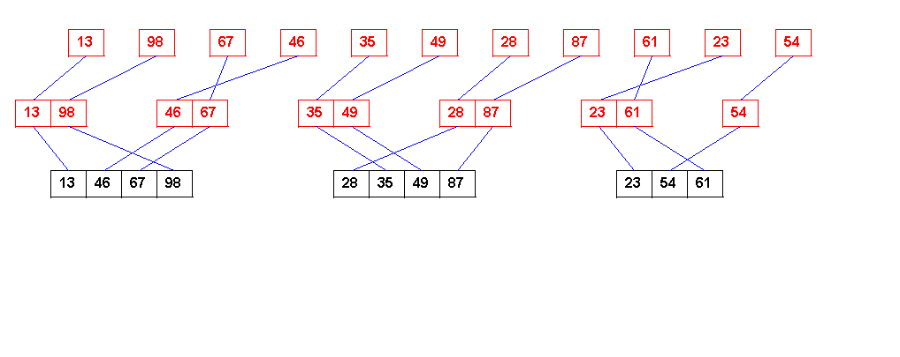
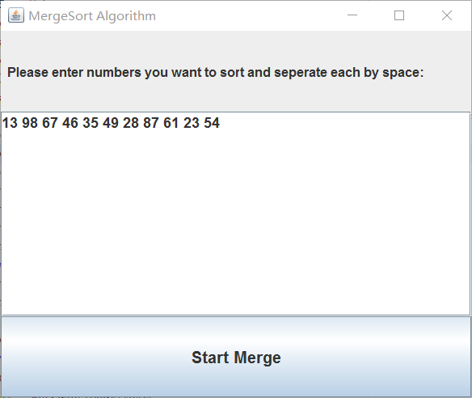
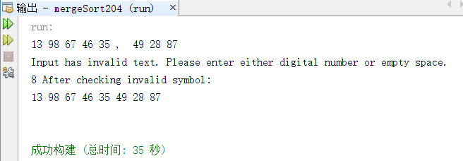
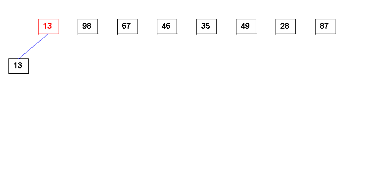

 - 归并排序的非递归算法实现的算法部分学习了 [归并排序三种实现方法（递归、非递归和自然合并排序）](http://blog.csdn.net/angelniu1024/article/details/8765618%20%E2%80%9C%E5%BD%92%E5%B9%B6%E6%8E%92%E5%BA%8F%E4%B8%89%E7%A7%8D%E5%AE%9E%E7%8E%B0%E6%96%B9%E6%B3%95%EF%BC%88%E9%80%92%E5%BD%92%E3%80%81%E9%9D%9E%E9%80%92%E5%BD%92%E5%92%8C%E8%87%AA%E7%84%B6%E5%90%88%E5%B9%B6%E6%8E%92%E5%BA%8F%EF%BC%89%E2%80%9D) 摘片段如下：

> 	 1)   基本思想：
> 将数组中的相邻元素两两配对。用Merge()函数将他们排序，构成n/2组长度为2的排序好的子数组段，然后再将他们合并成长度为4的子数组段，如此继续下去，直至整个数组排好序
> 
> 	 2)   具体过程如下图所示： 	 例1：8   3   2   6   7   1   5   4 	
> 

 - 将算法部分实现后，用java的awt和swing实现算法的动画效果
	实现的效果如下：
 

 - 完整流程：
   1. 输入框输入数字 
   
   
   2. 检查输入是否有除了数字和空格的非法字符
   
   
   3.  开始归并算法的非递归演示的动画 （因为屏幕大小问题，当输入大于16时弹出框将全屏显示，但即使如此，1920*1080的屏幕也建议输入不要超过22个，不然右边会超出屏幕不显示）
   
 
 - Java代码：
 （因为是算法课的一个小作业，花了一天写的，用了比较多的数据结构去实现（耗费比较多空间），可能有的地方的代码不是最好的实现方式）
 
 - 同时发在了我个人博客上：http://blog.csdn.net/sriting/article/details/70984896